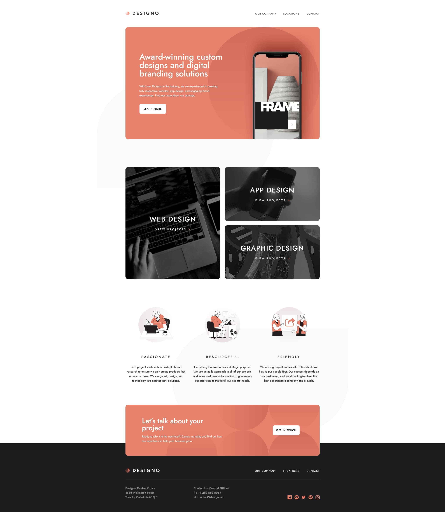

# Frontend Mentor - Designo agency website solution

This is a solution to the [Designo agency website challenge on Frontend Mentor](https://www.frontendmentor.io/challenges/designo-multipage-website-G48K6rfUT). Frontend Mentor challenges help you improve your coding skills by building realistic projects.

My solution is identical compare to the intitial design ✔

## Table of contents

- [Overview](#overview)
  - [The challenge](#the-challenge)
  - [Screenshot](#screenshot)
  - [Links](#links)
- [My process](#my-process)
  - [Built with](#built-with)
  - [What I learned](#what-i-learned)
- [Author](#author)

## Overview

### The challenge

Users should be able to:

- View the optimal layout for each page depending on their device's screen size
- See hover states for all interactive elements throughout the site
- Receive an error message when the contact form is submitted if:
  - The `Name`, `Email Address` or `Your Message` fields are empty should show "Can't be empty"
  - The `Email Address` is not formatted correctly should show "Please use a valid email address"
- **Bonus**: View actual locations on the locations page maps (we recommend [Leaflet JS](https://leafletjs.com/) for this)

### Screenshot

### Links

- Solution URL: [https://www.frontendmentor.io/solutions/designo-html-css-js-bGATFfY9r](https://www.frontendmentor.io/solutions/designo-html-css-js-bGATFfY9r)
- Live Site URL: [https://clement-baradel-designo.vercel.app](https://clement-baradel-designo.vercel.app)

## My process

### Built with

- Semantic HTML5 markup
- CSS custom properties
- Flexbox
- Mobile-first workflow
- Javascript ES6

### What I learned

Principally confirming my skills and review basics:

* Tricky Absolute/Relative position
* Contact section (without mailing)

## Author

- Website - [SOON]
- Frontend Mentor - [@Koyazh](https://www.frontendmentor.io/profile/Koyazh)
- Linkedin - [BaradelClément](https://www.linkedin.com/in/cl%C3%A9ment-baradel-330460209)
